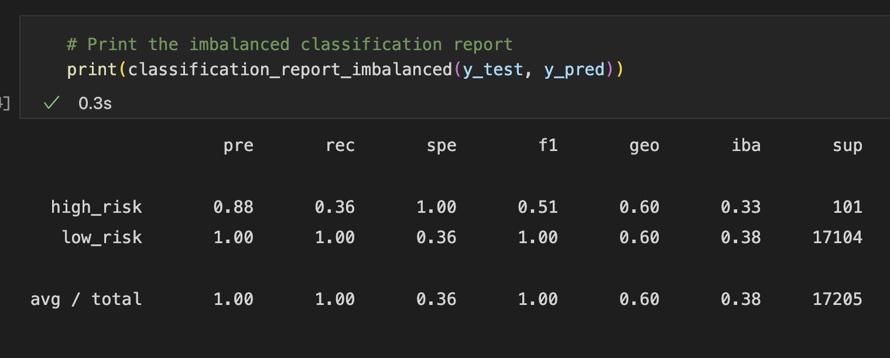
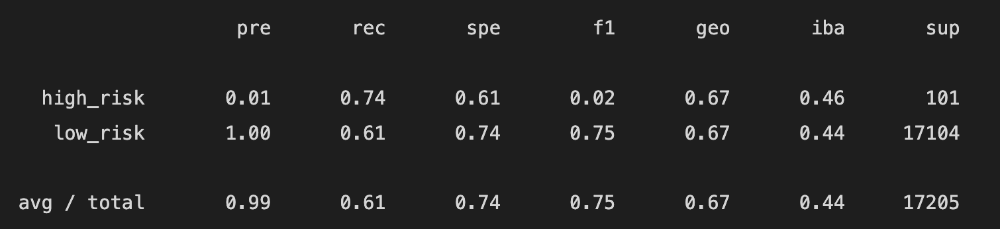
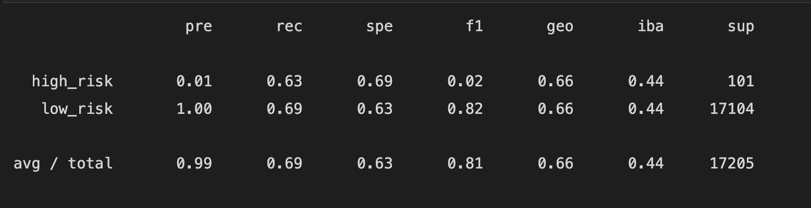
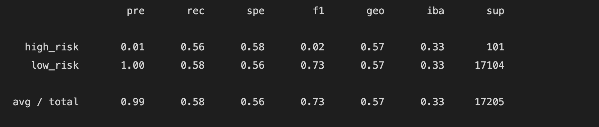
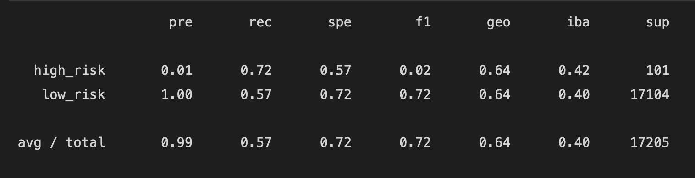
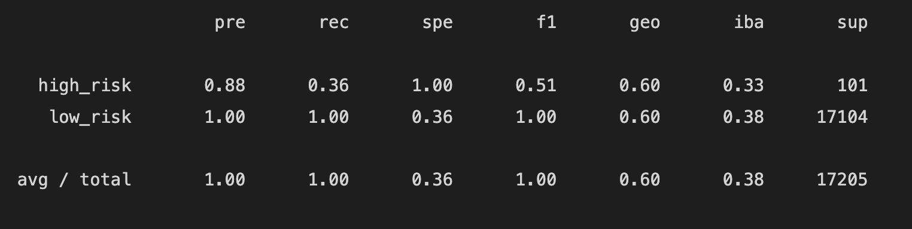
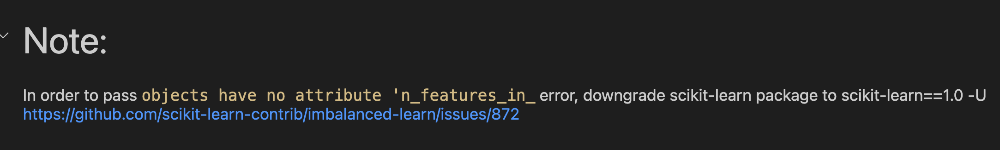
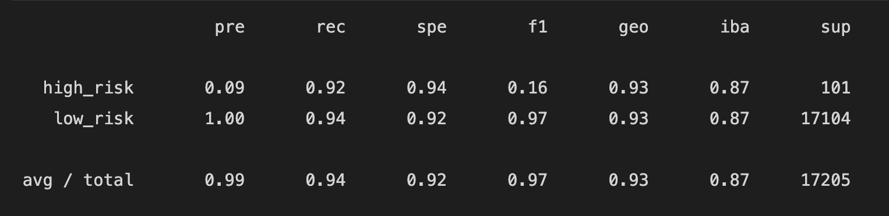

# Supervised Machine Learning in Predicting Credit Risk

For this project I used a variety of supervised machine learning techniques to test which model would produce acceptable training results while also not overfitting to the training data and ultimately producing the best results to new test data.  

# Overview

The project utilized both Resampling models and Ensemble classifiers to create and test several models.   The Resampling models seek to overcome the data sampling imbalance inherent in predicting risk.  The proportion of observed high-risk to low-risk applicants in the data set is approximately 250 - 51,000  meaning a model that accurately predicted high-risk 95% of the time could technically perform worse than not predicting any risk.  To deal with this imbalance, the SciKit-Learn library has created different methods to either scale up the smaller group (oversampling) or scale down the larger population (undersampling) or combine both approaches (over and under sampling)

The Ensamble method starts instead by taking a single decision-making approach which is unlikely to work well with generalized data outside of the training environment and replicating many hundreds or thousands of iterations to create a more robust predictive model.  

Furthermore, data often has to go through a rigorous process of preprocessing and scaling before it is ready to be fed into a machine learning algorithm.   

So how to tell what a model that works well looks like?

# Results

Describe the balanced accuracy, precision, and recall of all six models:

# Resampling techniques:

## Oversampling

### Naive random oversampling:

- **Balanced accuracy:** .674
- **Precision:** low for high risk, high for low risk
- **Recall:** high/low risk = .74/.61 

### SMOTE:

- **Balanced accuracy:** .662
- **Precision:** low for high-risk, high for low-risk
- **Recall:** high/low risk = .63/.69

## Undersampling

 ### ClusterCentroids

- **Balanced accuracy:** .571
- **Precision:** low for high-risk, high for low-risk
- **Recall:** high/low risk = .56/.58

## Combination (over-and under-sampling)

 ### SMOTEEN

- **Balanced accuracy:** .644
- **Precision:** low for high-risk, high for low-risk
- **Recall:** high/low risk = .72/.57

## Ensamble

 ### Random Forrest 

- **Balanced accuracy:** .644
- **Precision:** high for high-risk, high for low-risk
- **Recall:** high/low risk = .36/1.0

 ### Easy Ensemble

- **Balanced accuracy:** .93
- **Precision:** low for high-risk, high for low-risk
- **Recall:** high/low risk = .36/1.0

# Summary 

According to the results delivered here, The Random Forrest method delivers the best combination of precision for high- and low-risk.  While the Easy Ensamble method delivers the best balanced accuracy results, the Random Forrest has higher precision for high-risk as well as a strong F1 result for the weighted average of true positive results  
